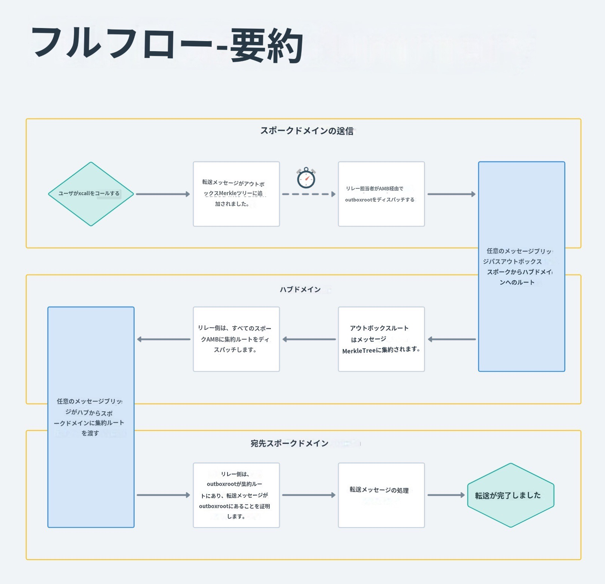

# 仕組み

Connextのネットワークのこの反復は、スタックの流動性と輸送層として[nxtpと](https://github.com/connext/nxtp)ルータを利用しています。一般化されたクロスチェーンメッセージングを提供するために暫定的なAMBソリューションを構築しており、将来的には本格的な楽観的ブリッジソリューションにアップグレードするために状況を監視し続ける予定です。すべては、クロスチェーン通信によるモジュール相互運用性の実現のために。

### コアフロー 

<figure><figcaption></figcaption></figure>

コネクストを経由するトランザクションは、以下のようなライフサイクルになります。

* ユーザーは、Connextコントラクトの`xcall`関数を呼び出し、資金、ガスの詳細、任意のデータ、およびターゲットアドレスオブジェクト（チェーン情報を含む）を渡して、取引を開始する。
  * _注：`xcallは`_solidityの下位コールを可能な限り模倣することを意図しています。
* コネクストの契約は
  * 必要に応じて、渡されたトークンを同じアセットのAMBバージョンに交換します。
  * トランザクションの詳細のハッシュを持つAMBコントラクトを呼び出し、チェーン間で60分のメッセージレイテンシーを開始させる。
  * トランザクションの詳細を示すイベントを発信する。
* デスティネーションチェーンに資金があるオリジンチェーンを観測しているルーターは、以下のようになります。
  * トランザクションをシミュレートする（これが失敗した場合、これは認証を必要とする、より「表現力豊かな」クロスチェーンメッセージであるため、AMBを経由する必要がある：遅いパス）ことが前提である。
  * 受信チェーン上の資金を使用して署名されたトランザクションオブジェクトを準備する。
  * このオブジェクト（「入札」）をオークショニアに掲示する。
  * _注：ルーターに十分な資金がない場合、転送額の一部のみを提供することも可能です。_
* オークショニアは基礎となるチェーンをすべて観察する。Xブロックごとに、オークショニアは取引の入札を集める。オークショニアは与えられた取引に対して正しいルータ（または複数のルータ！）を選択する責任を負う（ランダムでもよい）。オークショニアはこれらの入札のバッチをリレーヤーネットワークにポストし、チェーンに送信する。
* ある入札がチェーンに提出されたとき、契約は次のように行われます。
  * 取引に必要な資金が十分にあることを確認する。
  * 必要に応じて、ルーターのAMB風味の資金をチェーンの正規の資産と交換する。
  * スワップした資金を正しいターゲットに送る（コントラクトであれば、ターゲットに対して`calldataも`実行する）。
  * ルーターのパラメータをハッシュ化し、このハッシュとルーターのアドレスのマッピングをコントラクトに格納します。
    * _この時点で、ユーザーのトランザクションはすでに完了しています!_
* その後、スローパスメッセージが届くと、AMBで受け取った保留中のハッシュをすべて取り出し、ハッシュ→ルーターアドレスマッピングで対応するルーターアドレスを持っているかどうかを調べるために、大きくバッチしたトランザクションを送信することができる。もし対応するアドレスがあれば、AMBアセットが鋳造され、ルーターに渡される。
  * _注意：もしルーターが間違った金額をユーザーに渡したり、間違ったcalldataを実行した場合、ルーターのparamハッシュはAMB経由で送られてくるハッシュと一致せず、ルーターは払い戻しを受けられなくなります。これは、ルーターが正しく動作することを保証するための中核的なセキュリティメカニズムである。_
  * _注：ルーターは取引中継の際、60分間の資金ロックアップを受けます。これは理論的には既存のシステムと比較して資本効率を低下させるが、実際にはリバランスの必要がないため、ルーターはより多くの資本をより頻繁に利用できることになる。_
